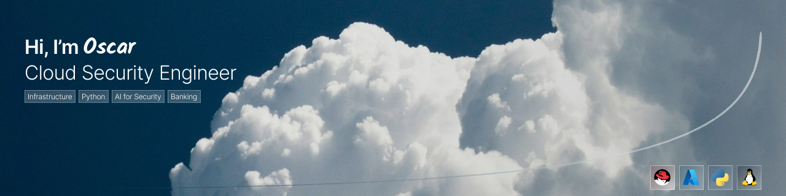

<h2>Hi, I’m Oscar García 👋</h2>

I’m in the final stage of my Computer Systems Engineering degree and transitioning into <b>Cloud Security Engineering</b>.

I previously worked in <b>IT/Technical Support (Automotive)</b>, assisting with basic troubleshooting (Windows/network/connectivity),
documenting issues, and escalating cases while supporting infrastructure tasks under supervision.

I’m seeking <b>entry-level / internship</b> opportunities as a <b>Cloud Security Engineer</b>, focused on <b>banking & financial security</b>,
and open to other regulated industries.

Currently: <b>AZ-900</b> (in progress) + <b>IBM Cybersecurity Analyst</b>. I’m building a portfolio with <b>Python security tooling</b> and
<b>AI-assisted security triage</b>.

<b>📫</b> oscaargarci@gmail.com

<h3>📌 About This Profile</h3>

This profile is built to document and showcase <b>hands-on labs</b> and <b>security tooling</b> as I learn and apply them in real scenarios.
Everything here is oriented toward becoming a <b>Cloud Security Engineer</b> with a strong focus on <b>banking/financial environments</b>.

You’ll find practical work such as: <b>Azure security labs</b>, <b>Linux hardening</b>, and <b>Python/AI-assisted security tools</b>—all designed to be clear, reproducible, and portfolio-ready.

### What I’m Building
🟦 **Azure Security Labs**  
→ IAM/RBAC · Logging/Monitoring · Secrets · Baseline hardening

🟥 **Linux (RHEL) Hardening**  
→ Hardening notes · CIS-style checklists · Audit & access controls

🟨 **Python Security Tools**  
→ Triage helpers · Log parsing · Reporting · Detection utilities

## Focus Areas

-EE0000?style=flat&logo=redhat&logoColor=white)

<i>Thanks for visiting my profile—feel free to explore my work.</i>

